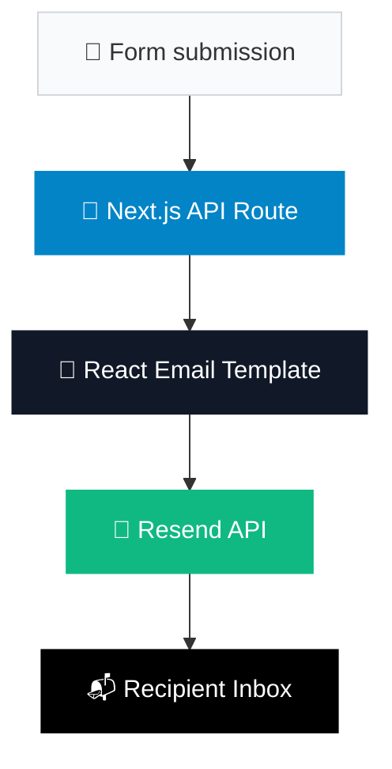

# ✉️ Sending an email with React Email and Resend 🚀

In this tutorial we will show the basic capabilities of the [Resend SDK](https://github.com/resend/resend-node) to send an email directly from your Next.js application.

We will mock up a basic frontend consisting of a form to capture user data and use [React Email](https://react.email/) to design a professional-looking email notification that works accross different email clients.

## 🤨 Why bother? 

Sending transactional emails from an application often introduces unexpected complexity. You often have to deal with HTML that renders consistently accross different email clients, inline styles, table-based layouts, and then figure out reliable email delivery.

With React Email, templates are built using standard React components, allowing the framework to generate client-compatible HTML under the hood. Resend then handles the delivery through a simple Node.js SDK, so you don't have to set up and manage an SMTP server yourself.

For a quick glance at these two technologies you may take a look at the following videos:

- 🎥 **[Modern Emails Using React (React Conf Talk)](https://www.youtube.com/watch?v=cQy24szSsBw)** — Context on why React Email was built.
- 🎥 **[Getting started with Resend](https://www.youtube.com/watch?v=FzoakVwRm2Q)** — High-level introduction to the Resend API.

## 🎓 What you'll learn

By following this tutorial you will:

1.  Create an email template as a React component using React Email
2.  Build a frontend form to collect and send email data
3.  Use Next.js App Router to handle email requests server-side
4.  Use the Resend SDK to deliver emails reliably

For this example, we will simulate a billing failure notification being triggered and delivered to a recipient. The email can optionally include an attachment (invoice PDF) and a custom link.

## 🧩 Components

- **Email template** (`BillingFailureEmail.tsx`) focuses purely on presentation
- **API route** (`route.tsx`) focuses purely on logic
- **Frontend** (`page.tsx`) focuses purely on user interaction




## 🚩 Prerequisites

- **Node.js**
- **npm**
- Basic **JavaScript/TypeScript/React** knowledge
- A **[Resend account](https://resend.com)** and **[API key](https://resend.com/docs/create-an-api-key)**
- (Optional) A verified sending domain in Resend; for testing, use `onboarding@resend.dev`

## ⚡ Quick Start (TL;DR)

Just want to run it? This gets you from clone to sent email:

```bash
# Clone and install Dependencies
git clone <your-repo-url>
cd resend-manual
npm install

# Create a `.env.local` File in the project root
cp .env.example .env.local

# Set your RESEND_API_KEY Variable in the `.env.local` file

# Start the Development Server
npm run dev
```

Once the server is running:

1. Go to [http://localhost:3000](http://localhost:3000)
2. Fill out the form with test data
3. Check "Include Invoice Attachment" and/or "Include Repository Link"
4. Click "Send Email"
5. You'll see a success message with the email ID

---

## 🤔 How does it work?

This section walks through the three componetnts, focusing on the code that connects them. The project's actual files are more complete, with full markup, Tailwind styling, and additional detail, so open them directly in src/ for the full implementation.

### Step 1: Email Template (React Component)

The email template lives in `src/emails/BillingFailureEmail.tsx`. It's a React component that accepts data as [props](https://react.dev/learn/passing-props-to-a-component) and renders an HTML email:

```tsx
// Define what data this email needs
interface BillingFailureEmailProps {
  customerName: string;
  invoiceNumber: string;
  amountDue: string;
  chargeAttemptDate: string;
  nextRetryDate: string;
  repoLinkLabel?: string;      // Optional
  repoLinkUrl?: string;        // Optional
}

// Create the component that renders the email
export default function BillingFailureEmail({
  customerName,
  invoiceNumber,
  amountDue,
  chargeAttemptDate,
  nextRetryDate,
  repoLinkLabel,
  repoLinkUrl,
}: BillingFailureEmailProps) {
  return (
    <Html>
      <Head />
      <Body style={{ backgroundColor: "#f4f1eb" }}>
        <Container>
          <Text>Hi {customerName},</Text>
          <Text>We couldn't process your payment. Please update your payment method.</Text>
          
          {/* Display billing details */}
          <Section>
            <Text><strong>Invoice:</strong> {invoiceNumber}</Text>
            <Text><strong>Amount:</strong> ${amountDue}</Text>
            <Text><strong>Attempted:</strong> {chargeAttemptDate}</Text>
            <Text><strong>Next Retry:</strong> {nextRetryDate}</Text>
          </Section>

          {/* Action button */}
          <Button href="https://example.com/billing">Update Payment</Button>

          {/* Conditionally show repo link if provided */}
          {repoLinkLabel && repoLinkUrl && (
            <Link href={repoLinkUrl}>{repoLinkLabel}</Link>
          )}
        </Container>
      </Body>
    </Html>
  );
}
```

**Key parts:**

1. **The Interface** (`BillingFailureEmailProps`): Defines what data the email accepts as inputs
2. **The Component Function** (`BillingFailureEmail`): Accepts the props and allows easy access to them
3. **React Email Components** (`Html`, `Body`, `Container`, `Text`, `Button`, etc.): These are the building blocks of the template, no more messy raw HTML!
4. **Dynamic Content with Curly Braces**

This component is just a template. It doesn't send anything—it just describes what the email should look like. You pass in data (customer name, invoice number, etc.), and the component renders that data into HTML.

### Step 2: Frontend Form

The form in `src/app/page.tsx` collects email data:

- Recipient email
- Customer name
- Invoice number
- Amount due (in USD)
- Charge attempt date
- Next retry date
- Optional: Attachment checkbox
- Optional: Repository link (label + URL)

```tsx
'use client';

import { useState } from 'react';

export default function Page() {
  const [formData, setFormData] = useState({
    recipientEmail: '',
    customerName: '',
    // ...remaining fields
    includeAttachment: false,
    includeRepoLink: false,
  });
  const [message, setMessage] = useState('');

  const handleChange = (e: React.ChangeEvent<HTMLInputElement>) => {
    const { name, value, type, checked } = e.target;
    setFormData((prev) => ({
      ...prev,
      [name]: type === 'checkbox' ? checked : value,
    }));
  };

  const handleSubmit = async (e: React.FormEvent) => {
    e.preventDefault();
    const response = await fetch('/api/send-billing-failure', {
      method: 'POST',
      headers: { 'Content-Type': 'application/json' },
      body: JSON.stringify(formData),
    });
    const data = await response.json();
    setMessage(`Email sent successfully! ID: ${data.id}`);
  };

  // ...form JSX, wiring each input's onChange to handleChange and the form's onSubmit to handleSubmit
}
```

**Key parts:**

1. **`'use client'` Directive** (first line): Marks this as a client component (React component, not a server-side page)
2. **Form State** (`useState({ recipientEmail, customerName, ... })`): Stores the data the user inputs into the form
3. **The `handleChange` Function**: Runs every time a user types or clicks a checkbox
4. **The `handleSubmit` Function**: Runs when the user clicks "Send Email"

This form is the frontend. It collects data and sends it to your backend. The frontend never has access to the API key—it just sends data to the server and waits for a response.

When submitted, it sends a POST request to `/api/send-billing-failure`.

### Step 3: API Route (Server-Side Logic) and email submission

The API route at `src/app/api/send-billing-failure/route.tsx` handles the request:

```tsx
import { Resend } from "resend";
import BillingFailureEmail from "@/emails/BillingFailureEmail";
import { readFileSync } from "fs";
import { join } from "path";

export async function POST(request: Request) {
  // 1. Extract data from the request
  const body = await request.json();

  // 2. Initialize Resend client with API key (server-side only)
  const resend = new Resend(process.env.RESEND_API_KEY);

  // 3. Handle optional attachment
  const attachments = [];
  if (body.includeAttachment) {
    const filePath = join(process.cwd(), "public/files/invoice.pdf");
    const fileBuffer = readFileSync(filePath);
    attachments.push({
      filename: "invoice.pdf",
      content: fileBuffer,
    });
  }

  // 4. Build the email configuration
  const emailConfig = {
    from: process.env.RESEND_FROM_EMAIL || "onboarding@resend.dev",
    to: body.recipientEmail,
    subject: "Billing Failure Notification",
    react: (
      <BillingFailureEmail
        customerName={body.customerName}
        invoiceNumber={body.invoiceNumber}
        amountDue={body.amountDue}
        //..remaining fields read from body
      />
    ),
    ...(attachments.length > 0 && { attachments }),
  };

  // 5. Send the email
  const response = await resend.emails.send(emailConfig);

  // 6. Return the result to the frontend
  return Response.json({ id: response.data?.id });
}
```

**Key parts:**

1. **Imports**: 
   - `Resend`: The email sending library
   - `BillingFailureEmail`: Your React Email component
   - `readFileSync`, `join`: Node.js file system utilities for handling attachments
2. **The `POST` Function**: This is the endpoint handler. When the frontend calls `/api/send-billing-failure`, this function runs
3. **Extract Form Data** (`const body = await request.json()`): Converts the JSON request body into a JavaScript object
4. **Initialize Resend** (`new Resend(process.env.RESEND_API_KEY)`): Creates a Resend client using your secret API key
5. **Build Email Configuration**
   - `from`: The sender address (from environment)
   - `to`: The recipient (from form data)
   - `subject`: The email subject line
   - `react`: The React Email component with all the data passed as props
   - `attachments`: Conditionally included only if there are attachments
6. **Send the Email** (`await resend.emails.send(emailConfig)`): Calls Resend's API to send the email
7. **Return Response** (`Response.json({ id: response.data?.id })`): Sends a response back to the frontend

This is the backend. The user request gets routed to the correct function and the Resend API is called to route the email to the recipient's mail server.

---

## 🚧 Production Considerations

This example shows the core concepts and data flow to send an email from your Next.js application using Resend, but it does not cover production concerns such as:

- [Handling email bounces](https://resend.com/docs/dashboard/emails/email-bounces)
- [Input validation](https://resend.com/blog/how-to-validate-form-inputs)
- [Rate limiting](https://resend.com/docs/api-reference/rate-limit)
- [Prevent duplicate emails (Idempotency keys)](https://resend.com/docs/dashboard/emails/idempotency-keys)
- [Domain Verification](https://resend.com/docs/dashboard/domains/introduction)

---

## 🆘 Troubleshooting

### "RESEND_API_KEY is not configured"
- Verify `.env.local` exists in the project root
- Verify `RESEND_API_KEY=...` is present in `.env.local`
- Restart the dev server after changing `.env.local`

### "Resend API key is invalid"
- Generate a new key at [resend.com/keys](https://resend.com/keys)
- Ensure you're using the full key (including `re_` prefix)

### "Cannot find module 'invoice.pdf'"
- Verify `public/files/invoice.pdf` exists
- The attachment checkbox won't work without this file

---

## 📚 Resources

- **[Resend Documentation](https://resend.com/docs)**
- **[React Email Documentation](https://react.email/docs)**
- **[Next.js API Routes](https://nextjs.org/docs/app/building-your-application/routing/route-handlers)**

